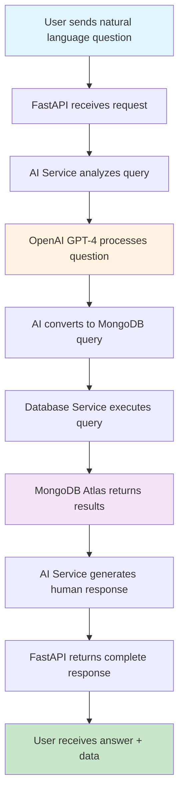
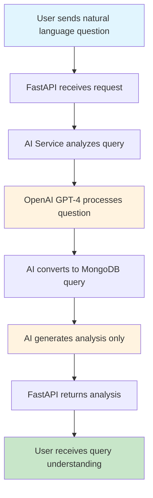

# 🔄 DB-AI-AGENT Flow Diagram

## 📊 **Overall System Architecture**

```
┌─────────────────┐    ┌─────────────────┐    ┌─────────────────┐
│   User Request  │───▶│  FastAPI Server │───▶│  MongoDB Atlas  │
│  (Natural Lang) │    │   (Port 8000)   │    │   (Cloud DB)    │
└─────────────────┘    └─────────────────┘    └─────────────────┘
                              │
                              ▼
                    ┌─────────────────┐
                    │   OpenAI API    │
                    │ (GPT-4 Turbo)   │
                    └─────────────────┘
```

## 🔍 **Detailed Flow Diagrams**

### **1. Query API Flow (`/api/v1/query`)**



**Step-by-Step Process:**
1. **User Input**: "How many purchaseMethod is Online"
2. **AI Analysis**: Converts to `{"purchaseMethod": "Online"}`
3. **Query Execution**: `db.sales.countDocuments({"purchaseMethod": "Online"})`
4. **Database Hit**: MongoDB Atlas returns `1585`
5. **AI Response**: "There have been 1,585 purchases made online"
6. **Final Output**: Complete response with data + analysis

### **2. Analyze API Flow (`/api/v1/analyze`)**



**Step-by-Step Process:**
1. **User Input**: "How many purchaseMethod is Online"
2. **AI Analysis**: Converts to `{"purchaseMethod": "Online"}`
3. **Query Understanding**: Identifies as `count` operation on `sales` collection
4. **No Database Hit**: Query is NOT executed
5. **Analysis Output**: Query intent + suggestions
6. **Final Output**: Analysis only (no actual data)

## 🏗️ **Component Architecture**

```
┌─────────────────────────────────────────────────────────────────┐
│                        DB-AI-AGENT                            │
├─────────────────────────────────────────────────────────────────┤
│  ┌─────────────┐  ┌─────────────┐  ┌─────────────┐          │
│  │   FastAPI   │  │   OpenAI    │  │  MongoDB    │          │
│  │   Server    │  │   Service   │  │  Service    │          │
│  └─────────────┘  └─────────────┘  └─────────────┘          │
│         │                │                │                   │
│         ▼                ▼                ▼                   │
│  ┌─────────────┐  ┌─────────────┐  ┌─────────────┐          │
│  │   Routes    │  │   GPT-4     │  │  Connection │          │
│  │   /query    │  │   Turbo     │  │   Manager   │          │
│  │   /analyze  │  │   Model     │  │             │          │
│  │   /schema   │  └─────────────┘  └─────────────┘          │
│  └─────────────┘                                           │
└─────────────────────────────────────────────────────────────────┘
```

## 🔄 **Data Flow Examples**

### **Example 1: Query API - "How many documents are in sales?"**

```
User Request
    │
    ▼
┌─────────────────┐
│ FastAPI Router  │
│ /api/v1/query   │
└─────────────────┘
    │
    ▼
┌─────────────────┐
│ AI Service      │
│ analyze_query() │
└─────────────────┘
    │
    ▼
┌─────────────────┐
│ OpenAI GPT-4    │
│ "Convert to:    │
│ count_docs({})" │
└─────────────────┘
    │
    ▼
┌─────────────────┐
│ Database Service│
│ execute_count() │
└─────────────────┘
    │
    ▼
┌─────────────────┐
│ MongoDB Atlas   │
│ Returns: 5000   │
└─────────────────┘
    │
    ▼
┌─────────────────┐
│ AI Service      │
│ generate_response│
│ "5,000 docs"    │
└─────────────────┘
    │
    ▼
┌─────────────────┐
│ User Response   │
│ Success: true   │
│ Data: 5000      │
│ Time: 5.01s     │
└─────────────────┘
```

### **Example 2: Analyze API - "Show me all unique purchaseMethod values"**

```
User Request
    │
    ▼
┌─────────────────┐
│ FastAPI Router  │
│ /api/v1/analyze │
└─────────────────┘
    │
    ▼
┌─────────────────┐
│ AI Service      │
│ analyze_query() │
└─────────────────┘
    │
    ▼
┌─────────────────┐
│ OpenAI GPT-4    │
│ "Convert to:    │
│ aggregate([     │
│   {$group: {    │
│     _id: "$purchaseMethod" │
│   }}            │
│ ])"             │
└─────────────────┘
    │
    ▼
┌─────────────────┐
│ Analysis Only   │
│ No DB Execution │
│ Query Type: aggregate │
│ Collection: sales     │
└─────────────────┘
    │
    ▼
┌─────────────────┐
│ User Response   │
│ Success: true   │
│ Analysis only   │
│ Time: 2.54s     │
└─────────────────┘
```

## 🎯 **Key Differences Visualization**

```
┌─────────────────────────────────────────────────────────────┐
│                    QUERY API                               │
├─────────────────────────────────────────────────────────────┤
│  User Question → AI Analysis → DB Query → Results → Answer │
│  ⏱️ 5.01s total (AI + DB)                                │
│  💰 Higher cost (2 API calls)                            │
│  📊 Returns actual data                                   │
└─────────────────────────────────────────────────────────────┘

┌─────────────────────────────────────────────────────────────┐
│                   ANALYZE API                             │
├─────────────────────────────────────────────────────────────┤
│  User Question → AI Analysis → Query Understanding        │
│  ⏱️ 2.54s total (AI only)                               │
│  💰 Lower cost (1 API call)                              │
│  📊 Returns analysis only                                 │
└─────────────────────────────────────────────────────────────┘
```

## 🔧 **Technical Components**

### **1. FastAPI Server (`app/main_simple.py`)**
```python
# Routes
@app.post("/api/v1/query")     # Execute queries
@app.post("/api/v1/analyze")   # Analyze queries
@app.get("/api/v1/schema")     # Get database schema
@app.get("/health")            # Health check
```

### **2. AI Service (`app/services/ai_service.py`)**
```python
class AIService:
    def analyze_query()     # Convert natural language to MongoDB query
    def generate_response() # Create human-readable answers
```

### **3. Database Service (`app/services/db_service.py`)**
```python
class DatabaseService:
    def execute_find_query()      # MongoDB find operations
    def execute_count_query()     # MongoDB count operations
    def execute_aggregate_query() # MongoDB aggregation
```

### **4. MongoDB Connection (`app/database/connection.py`)**
```python
class DatabaseManager:
    def get_database()           # Connect to MongoDB Atlas
    def get_collections()        # List available collections
    def get_schema()            # Analyze collection structure
```

## 🚀 **Request/Response Flow**

### **Query API Request:**
```json
{
  "query": "How many purchaseMethod is Online",
  "session_id": "test_session",
  "context": {},
  "max_results": 10,
  "include_analysis": true
}
```

### **Query API Response:**
```json
{
  "success": true,
  "response": "There have been 1,585 purchases made online in the data available.",
  "query_analysis": {
    "original_query": "How many purchaseMethod is Online",
    "processed_query": "{\"purchaseMethod\": \"Online\"}",
    "target_collection": "sales",
    "query_type": "count",
    "confidence_score": 0.95,
    "suggested_improvements": []
  },
  "query_result": {
    "query": "count_documents({'purchaseMethod': 'Online'})",
    "result": [{"count": 1585}],
    "total_count": 1,
    "execution_time": 0.006
  },
  "session_id": "test_session",
  "execution_time": 5.01,
  "timestamp": "2025-08-04T09:19:58.645831"
}
```

## 🎯 **Use Cases**

### **Query API Use Cases:**
- ✅ Get actual data counts
- ✅ Find specific records
- ✅ Run aggregations
- ✅ Get human-readable answers
- ✅ Production queries

### **Analyze API Use Cases:**
- ✅ Understand query intent
- ✅ Validate queries before execution
- ✅ Get query suggestions
- ✅ Faster response times
- ✅ Query testing

## 🔄 **Error Handling Flow**

```
Error Occurs
    │
    ▼
┌─────────────────┐
│ Exception Handler│
│ global_exception │
└─────────────────┘
    │
    ▼
┌─────────────────┐
│ Log Error       │
│ app.main_simple │
└─────────────────┘
    │
    ▼
┌─────────────────┐
│ Return Error    │
│ Response        │
│ JSON format     │
└─────────────────┘
```

## 📈 **Performance Metrics**

| API Type | Average Response Time | Database Hits | AI Calls | Use Case |
|----------|---------------------|---------------|----------|----------|
| **Query** | 5.01 seconds | ✅ Yes | 2 calls | Production |
| **Analyze** | 2.54 seconds | ❌ No | 1 call | Testing |

This flow diagram shows the complete architecture and data flow of your DB-AI-AGENT system! 🚀 