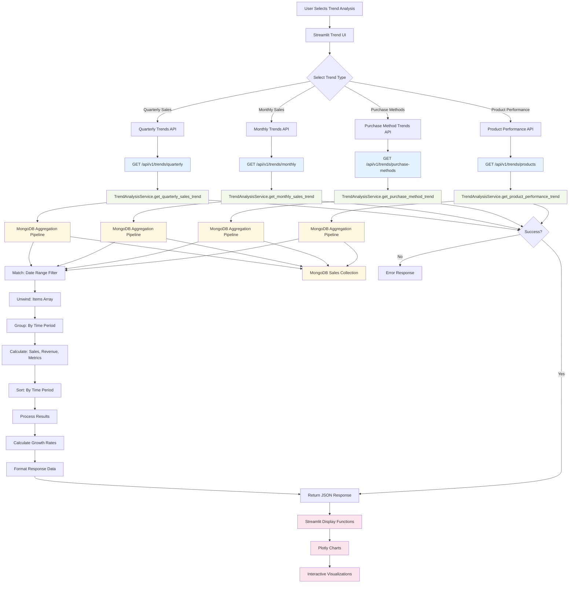
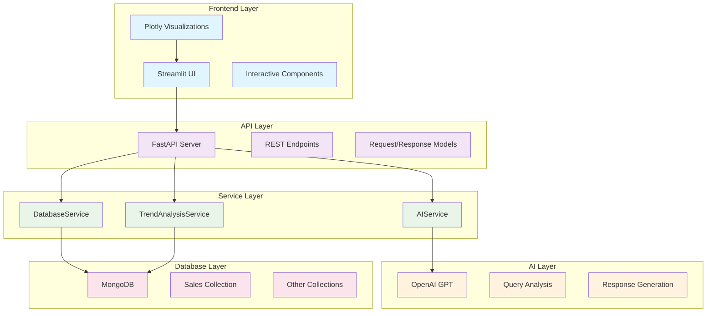

# DB-AI-AGENT NLP Flow Diagram

## Overview
This diagram shows the complete flow of natural language queries through the DB-AI-AGENT system, with special focus on the trend analysis API.

## Main Flow Diagram

```mermaid
flowchart TD
    %% User Interface Layer
    A[User Input: Natural Language Query] --> B{Query Type?}
    
    %% Query Processing Branch
    B -->|General Query| C[Streamlit UI]
    B -->|Trend Analysis| D[Trend Analysis UI]
    
    %% Streamlit UI Flow
    C --> E[API Request to /api/v1/query]
    E --> F[FastAPI Endpoint]
    F --> G[AIService.analyze_query]
    G --> H[OpenAI GPT Analysis]
    H --> I[Query Analysis Result]
    I --> J[DatabaseService.execute_query]
    J --> K[MongoDB Query Execution]
    K --> L[Query Results]
    L --> M[AIService.generate_response]
    M --> N[Natural Language Response]
    N --> O[Streamlit Visualization]
    
    %% Trend Analysis Flow
    D --> P[Trend Analysis Selection]
    P --> Q{Trend Type?}
    
    Q -->|Quarterly| R[/api/v1/trends/quarterly]
    Q -->|Monthly| S[/api/v1/trends/monthly]
    Q -->|Purchase Methods| T[/api/v1/trends/purchase-methods]
    Q -->|Product Performance| U[/api/v1/trends/products]
    
    %% Trend Analysis Processing
    R --> V[TrendAnalysisService.get_quarterly_sales_trend]
    S --> W[TrendAnalysisService.get_monthly_sales_trend]
    T --> X[TrendAnalysisService.get_purchase_method_trend]
    U --> Y[TrendAnalysisService.get_product_performance_trend]
    
    %% MongoDB Aggregation Pipeline
    V --> Z[MongoDB Aggregation Pipeline]
    W --> Z
    X --> Z
    Y --> Z
    
    Z --> AA[Processed Trend Data]
    AA --> BB[Streamlit Trend Visualization]
    
    %% Database Connection
    K --> CC[MongoDB Database]
    Z --> CC
    
    %% Error Handling
    G --> DD{Analysis Success?}
    DD -->|No| EE[Error Response]
    DD -->|Yes| I
    
    J --> FF{Query Success?}
    FF -->|No| GG[Database Error]
    FF -->|Yes| L
    
    V --> HH{Trend Analysis Success?}
    HH -->|No| II[Trend Analysis Error]
    HH -->|Yes| AA
    
    %% Styling
    classDef userInterface fill:#e1f5fe
    classDef apiLayer fill:#f3e5f5
    classDef aiLayer fill:#e8f5e8
    classDef databaseLayer fill:#fff3e0
    classDef errorLayer fill:#ffebee
    
    class A,C,D,P userInterface
    class E,F,R,S,T,U apiLayer
    class G,H,I,M,N aiLayer
    class J,K,Z,CC databaseLayer
    class EE,GG,II errorLayer
```

## Detailed Trend Analysis Flow



## Natural Language Query Processing Flow

```mermaid
flowchart TD
    %% Natural Language Query Flow
    A2[Natural Language Query] --> B2[Streamlit Text Input]
    B2 --> C2[Execute Query Button]
    C2 --> D2[POST /api/v1/query]
    
    %% AI Analysis
    D2 --> E2[AIService.analyze_query]
    E2 --> F2[OpenAI GPT Request]
    F2 --> G2[System Prompt + Query]
    G2 --> H2[AI Analysis Response]
    H2 --> I2[Parse JSON Response]
    
    %% Query Analysis Result
    I2 --> J2[QueryAnalysis Object]
    J2 --> K2{Query Type?}
    
    K2 -->|find| L2[DatabaseService.execute_find_query]
    K2 -->|aggregate| M2[DatabaseService.execute_aggregate_query]
    K2 -->|count| N2[DatabaseService.execute_count_query]
    
    %% Database Execution
    L2 --> O2[MongoDB find() Operation]
    M2 --> P2[MongoDB aggregate() Operation]
    N2 --> Q2[MongoDB countDocuments() Operation]
    
    %% Results Processing
    O2 --> R2[Query Results]
    P2 --> R2
    Q2 --> R2
    
    R2 --> S2[AIService.generate_response]
    S2 --> T2[Natural Language Response]
    T2 --> U2[Streamlit Display]
    
    %% Database Connection
    O2 --> V2[MongoDB Database]
    P2 --> V2
    Q2 --> V2
    
    %% Error Handling
    E2 --> W2{Analysis Success?}
    W2 -->|No| X2[Analysis Error]
    W2 -->|Yes| J2
    
    L2 --> Y2{Query Success?}
    M2 --> Y2
    N2 --> Y2
    
    Y2 -->|No| Z2[Database Error]
    Y2 -->|Yes| R2
    
    %% Styling
    classDef inputLayer fill:#e8f5e8
    classDef aiLayer fill:#e3f2fd
    classDef databaseLayer fill:#fff3e0
    classDef outputLayer fill:#fce4ec
    
    class A2,B2,C2 inputLayer
    class E2,F2,G2,H2,I2,S2,T2 aiLayer
    class L2,M2,N2,O2,P2,Q2,V2 databaseLayer
    class U2 outputLayer
```

## System Architecture Overview



## Key Components Description

### 1. **Frontend Layer (Streamlit)**
- **Streamlit UI**: User interface for natural language queries
- **Plotly Visualizations**: Interactive charts for trend analysis
- **Query Input**: Text area for natural language queries

### 2. **API Layer (FastAPI)**
- **REST Endpoints**: `/api/v1/query`, `/api/v1/trends/*`
- **Request/Response Models**: Structured data validation
- **CORS Middleware**: Cross-origin resource sharing

### 3. **Service Layer**
- **AIService**: OpenAI integration for query analysis
- **DatabaseService**: MongoDB query execution
- **TrendAnalysisService**: Specialized trend analysis

### 4. **AI Layer (OpenAI)**
- **Query Analysis**: Converts natural language to database queries
- **Response Generation**: Creates natural language responses
- **Confidence Scoring**: Evaluates query understanding

### 5. **Database Layer (MongoDB)**
- **Sales Collection**: Main data source for trend analysis
- **Aggregation Pipelines**: Complex data processing
- **Schema Information**: Collection structure metadata

## Trend Analysis Specific Features

### **Quarterly Trends**
- Groups sales by quarters
- Calculates growth rates
- Provides summary statistics

### **Monthly Trends**
- Monthly sales patterns
- Year-over-year comparisons
- Seasonal analysis

### **Purchase Method Trends**
- Payment method analysis
- Method popularity over time
- Revenue by payment type

### **Product Performance**
- Product sales trends
- Revenue analysis
- Quantity vs. price analysis

## Error Handling

The system includes comprehensive error handling at multiple levels:
- **API Level**: HTTP status codes and error messages
- **Service Level**: Database connection errors
- **AI Level**: OpenAI API failures
- **Frontend Level**: User-friendly error displays